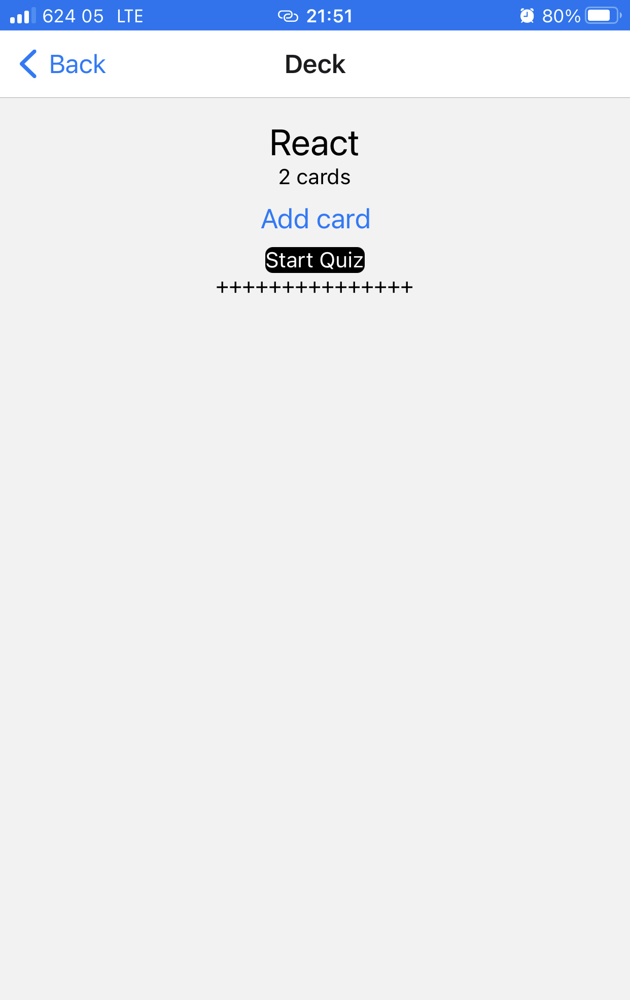
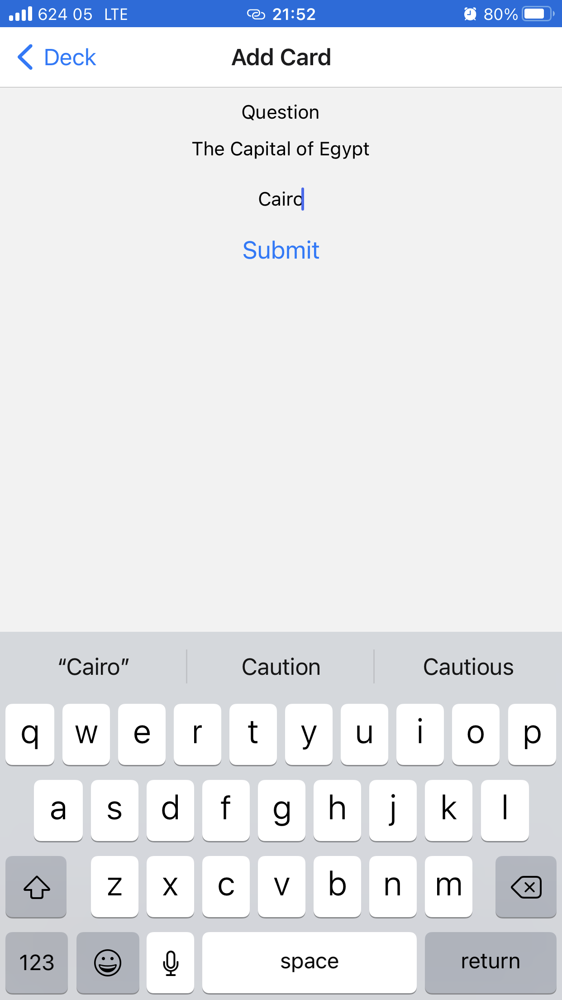
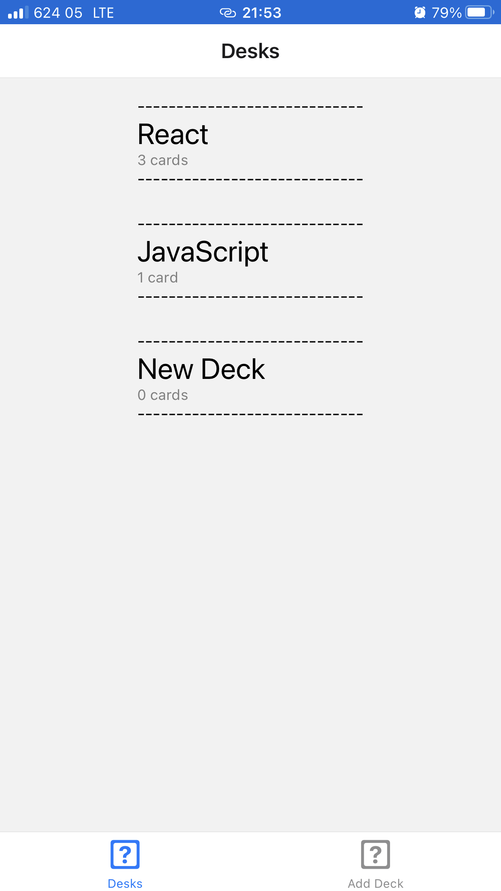

# udacicards
## Overview
In this project, will build a mobile application (Android or iOS - or both) that allows users to study collections of flashcards. The app will allow users to create different categories of flashcards called "decks", add flashcards to those decks, then take quizzes on those decks.

## Project Setup
- Ensure you at least node V14 installed
- install android and/or ios emulator
- Clone the project from github repo
- run 
```
yarn install 
```

### Usage
- Assumened you have your Emulators installed

- Launch the App with `yar start command`
- Open any current Deck or Add a New Deck
- You can addd more carrs to a Deck
- Start A Quiz
- View scores
- reset the Quiz or go back to another Deck


### Dependencies

Yarn add react-redux redux

npm install @react-navigation/native @react-navigation/native-stack

yarn add react-native-tab-view

npm install @react-navigation/material-top-tabs @react-navigation/bottom-tabs

### Platform.

 This application worked well on ios device using the expo app installed on it.

 
 ~[primary](img/primary_page.PNG)
 Primary View

 
 Deck View

 

 
 Quiz View

 
 Score

 
 New Deck

 
 Deck Added


